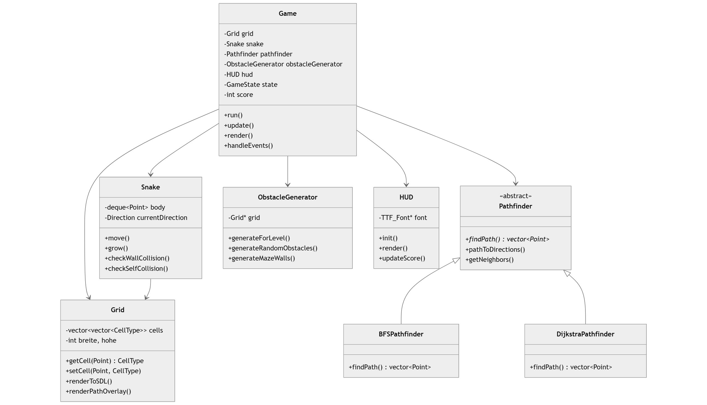

# SDL Snake Game mit Pathfinding-Algorithmen

Ein klassisches Snake-Spiel Simulation in C++ mit SDL2, erweitert um Bewegung mittels Pathfinding-Algorithmen (BFS & Dijkstra).


---

## Inhaltsverzeichnis

- [Features](#features)
- [Screenshot](#screenshot)
- [Installation](#installation)
- [Steuerung](#steuerung)
- [Architektur](#architektur)
- [Code-Analyse](#code-analyse)
- [Erweiterungsmöglichkeiten](#erweiterungsmöglichkeiten)

---

## Features

- **Klassisches Snake-Gameplay** mit flüssiger SDL2-Grafik
- **KI-AutoPlay-Modus** mit visueller Pfadanzeige
- **Zwei Pathfinding-Algorithmen**: BFS und Dijkstra
- **Dynamisches Level-System** mit 6+ verschiedenen Hindernis-Mustern
- **HUD mit Score-Anzeige** und Steuerungshinweisen
- **Mehrere Food-Items** gleichzeitig auf dem Spielfeld
- **Kollisionserkennung** für Wände, Hindernisse und Selbstkollision

---

##  Screenshot

---

## Installation

### Voraussetzungen

- C++17-kompatibler Compiler (GCC 7+, Clang 5+, MSVC 2017+)
- CMake 3.15+
- vcpkg (für Abhängigkeiten)

### Build-Anleitung

```bash
# Repository klonen
git clone https://github.com/Healxt/snakegame.git
cd snakegame

# vcpkg Abhängigkeiten installieren
vcpkg install sdl2 sdl2-ttf

# Build mit CMake
mkdir build && cd build
cmake .. -DCMAKE_TOOLCHAIN_FILE=[vcpkg-root]/scripts/buildsystems/vcpkg.cmake
cmake --build . --config Release

# Ausführen
./SnakeGame
```

### Abhängigkeiten (vcpkg.json)

| Paket    | Version | Beschreibung         |
|----------|---------|----------------------|
| SDL2     | 2.x     | Grafik & Input       |
| SDL2_ttf | 2.24+   | Schriftart-Rendering |

---

## Steuerung

| Taste       | Aktion                      |
|-------------|-----------------------------|
| `W` / `↑`   | Nach oben bewegen           |
| `S` / `↓`   | Nach unten bewegen          |
| `A` / `←`   | Nach links bewegen          |
| `D` / `→`   | Nach rechts bewegen         |
| `SPACE`     | AutoPlay ein/aus            |
| `1`         | BFS-Algorithmus wählen      |
| `2`         | Dijkstra-Algorithmus wählen |
| `P`         | Pause/Fortsetzen            |
| `R`         | Neustart (nach Game Over)   |
| `Q` / `ESC` | Beenden                     |

---

## Architektur

### Klassendiagramm



### Dateistruktur

```
SnakeGame/
├── main.cpp                  # Einstiegspunkt
├── game.h/.cpp               # Haupt-Spiellogik & SDL-Loop
├── grid.h/.cpp               # Spielfeld-Verwaltung
├── Snake.h/.cpp              # Schlangen-Logik
├── Pathfinder.h/.cpp         # Pathfinding-Algorithmen (BFS, Dijkstra)
├── ObstacleGenerator.h/.cpp  # Level-Design
├── HUD.h/.cpp                # UI-Rendering
├── common.h                  # Gemeinsame Typen (Point, Direction, CellType)
├── vcpkg.json                # Abhängigkeiten
└── Roboto.ttf                # Schriftart
```

---

##  Code-Analyse

### Kernkomponenten

#### 1. Game-Klasse (`game.h/.cpp`)

```cpp
// Hauptschleife (ca. 60 FPS)
void Game::run() {
    while (running) {
        handleEvents();  // Input verarbeiten
        update();        // Spiellogik aktualisieren
        render();        // Frame zeichnen
        SDL_Delay(16);   // ~60 FPS
    }
}
```

**Class Game Stärken:**
- Saubere Trennung von Input, Logik und Rendering
- Flexible Food-Verwaltung mit mehreren Items
- Integriertes Level-System

**Verbesserungspotential:**
- Hardcodierter Font-Pfad (`K:\SnakeGame\Roboto.ttf`)
- `moveDelay` könnte dynamisch an Level angepasst werden

#### 2. Snake-Klasse (`Snake.h/.cpp`)

Implementiert die Schlangen-Bewegung mit einer `std::deque`:

```cpp
void Snake::move() {
    Point newhead = getHeadPosition();
    // Position nach Richtung aktualisieren
    switch (currentDirection) { ... }
    
    body.push_front(newhead);      // Neuer Kopf vorne
    if (!shouldGrow) {
        body.pop_back();           // Schwanz entfernen
    }
}
```

**Design-Entscheidung:** `std::deque` ermöglicht direkte zugriff für `push_front` und `pop_back` – optimal für Snake-Bewegung.

#### 3. Pathfinder-Hierarchie (`Pathfinder.h/.cpp`)

```cpp
std::unique_ptr<Pathfinder> Pathfinder::create(Algorithm algo) {
    switch (algo) {
        case Algorithm::BFS:
            return std::make_unique<BFSPathfinder>();
        case Algorithm::DIJKSTRA:
            return std::make_unique<DijkstraPathfinder>();
    }
}
```

**Erweiterbarkeit:** Neue Algorithmen wie z.B:(A*, Greedy) können einfach hinzugefügt werden.

#### 4. Grid-Klasse (`grid.h/.cpp`)

2D-Spielfeld mit Zelltypen-System:

```cpp
enum class CellType {
    EMPTY,       // Begehbar
    WALL,        // Hindernis
    SNAKE_BODY,  // Schlangenkörper
    FOOD         // Essen
};
```

**Rendering-Ansatz:** Direktes SDL-Rendering pro Zelle mit Farbcodierung.

#### 5. ObstacleGenerator (`ObstacleGenerator.h/.cpp`)

Prozedurale Level-Generierung mit 8 verschiedenen Mustern:

| Level | Muster  | Beschreibung                 |
|-------|---------|------------------------------|
| 1-2   | Random  | Zufällige Einzelhindernisse  |
| 3     | Blocks  | Rechteckige Blöcke           |
| 4     | Corners | L-förmige Eckhindernisse     |
| 5     | Cross   | Zentrales Kreuz              |
| 6     | Maze    | Maze-Struktur                |

```cpp
// Validierung: Mindestens 50% des Raums erreichbar
bool canReachAllAreas(const Point& start) {
    // BFS-Flood-Fill zur Erreichbarkeitsprüfung
    return reachableCells >= totalEmptySpace * 0.5;
}
```

---

##  Erweiterungsmöglichkeiten
 - Was kann man noch dazu bauen?
### Kurzfristig

1. **A*-Algorithmus** hinzufügen.

2. **Geschwindigkeitsanpassung** nach Level:
```cpp
moveDelay = std::max(50, 150 - level * 10);
```

3. **Highscore-System** mit Datei-Persistenz

### Mittelfristig

4. **Mehrere Schlangen** (Multiplayer)
5. **Power-Ups** (Speed Boost, Schrumpfen, Unverwundbarkeit)
6. **Sound-Effekte** mit SDL_mixer

### Langfristig

7. **Online-Multiplayer** mit SDL_net
8. **Level-Editor** mit GUI

---

## Bekannte Issues

1. **Hardcodierter Font-Pfad** in `game.cpp:68`
   - Lösung: Relativer Pfad oder Ressourcen-System

2. **180°-Drehung** bei kurzer Schlange möglich
   - Bereits teilweise behandelt in `getNextAIMove()`

3. **Pfad wird jeden Frame neu berechnet**
   - Optimierung: Nur bei Food-Änderung/Kollision neu berechnen

---


## Autor

Entwickelt als Lernprojekt für C++.

